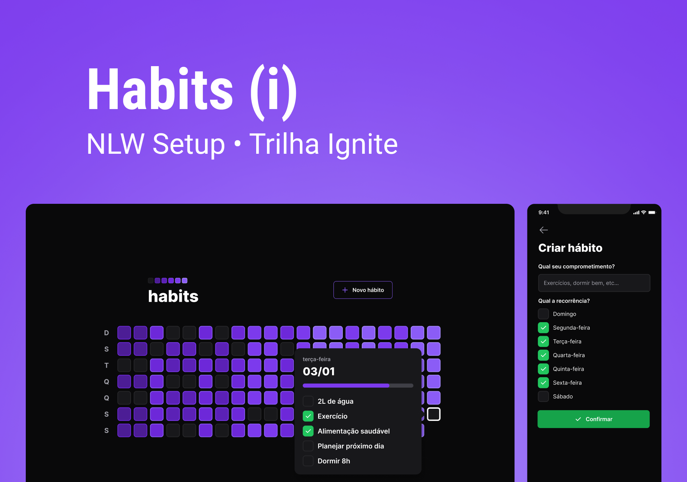
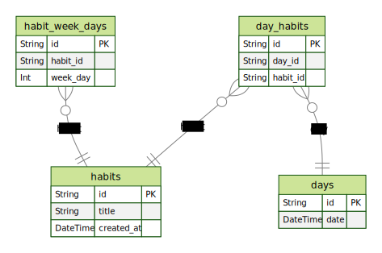

<h1 align="center">
  
</h1>

<h4 align="center">⌛ Next Level Week Setup ✅🚀 In progress! ⌛</h4>

  
  
  
  
  
  

  <a href="#-nlw">Next Level Week</a> | <a href="#-project">Project</a> |
  <a href="#rocket-Technologies">Technologies</a> |
  <a href="#-layout">Layout</a> | <a href="#-how-to-use">How to use</a> |
  <a href="#-how-to-contribute">How to contribute</a> |
  <a href="#memo-license">License</a> |
  <a href="https://fellipeutaka-nlwsetup.vercel.app/">Live demo</a>

## ℹ️ What's Next Level Week?

NLW is a practical week with lots of code, challenges, networking and a single objective: to take you to the next level.
Through our method you will learn new tools, learn about new technologies and discover hacks that will boost your career.
An online and completely free event that will help you take the next step in your evolution as a dev.

## 💻 Project

Habits is a habit tracker to help people keep track of their habits.

<h1 align="center">
  
</h1>

<h1 align="center">
  
</h1>

## 🚀 Technologies

This project was developed with the following technologies:

- [TypeScript][ts]
- [Node.js][node]
- [Nest][nest]
- [Prisma][prisma]
- [PostgreSQL][postgresql]
- [React][react]
- [Next.js][next]
- [TailwindCSS][tailwind]
- [React Native][rn]
- [Expo][expo]

## 🔖 Layout

To access the layout use [Figma][figma].

## 🤔 How to contribute

1. Fork this repository.
2. Create a branch: `git checkout -b <branch_name> `.
3. Make your changes and commit them: `git commit -m '<commit_message> '`
4. Push to original branch:`git push origin <project_name> / <local>`
5. Create the pull request. Or, see the GitHub documentation on [how to create a pull request][pr].

## 📝 License

This project is under the MIT license. See the [LICENSE](https://github.com/fellipeutaka/nlw-setup/blob/main/LICENSE) for details.

Made with ♥ by Fellipe Utaka 👋 [Get in touch!](https://www.linkedin.com/in/fellipeutaka/)

[figma]: https://www.figma.com/file/wRUFakZUUw46TwyrsHY6qC/Habits-(i)-(Community)?node-id=6%3A343&t=7MSUditkFuVZM6er-0
[pr]: https://help.github.com/en/github/collaborating-with-issues-and-pull-requests/creating-a-pull-request
[node]: https://nodejs.org/
[nest]: https://nestjs.com/
[prisma]: https://www.prisma.io/
[postgresql]: https://www.postgresql.org/
[ts]: https://www.typescriptlang.org/
[expo]: https://expo.dev/
[react]: https://reactjs.org
[next]: https://nextjs.org/
[tailwind]: https://tailwindcss.com/
[rn]: https://reactnative.dev/
